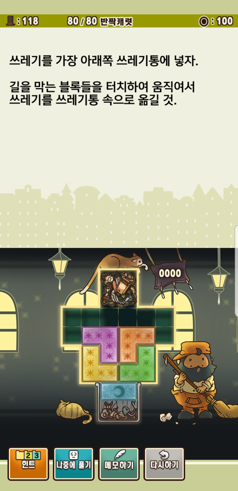
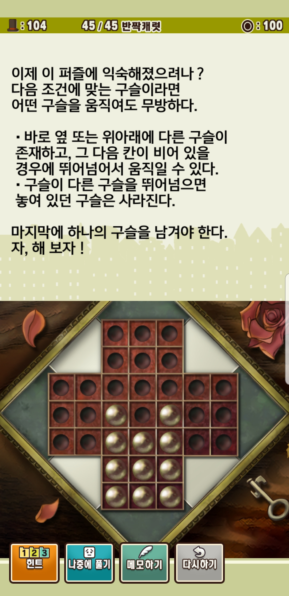

PuzzleSolver는 '레이튼 교수와 악마의 상자'라는 게임을 플레이하다가 풀리지 않는 퍼즐을 풀어보기 위해 만들어졌습니다.

깊이우선탐색과 너비우선탐색 두가지 방법을 사용하고 있으며, 세가지 퍼즐의 풀이를 적용했습니다.

깊이우선탐색과 너비우선 탐색을 위한 PuzzleBFS.py, PuzzleDFS.py는 상당히 유사한 구조로 이루어져있습니다.
두 파일은 퍼즐의 이동을 스택/큐에 저장하고 불러오는 역할을 하고 있습니다. 
퍼즐의 이동방식인 getWays() 함수는 각 퍼즐 클래스에서 구현하고 있습니다.

첫번째 퍼즐은 BlockPuzzle입니다. 
이 퍼즐은 블럭들을 움직여 특정 블럭을 목표위치로 보내는 것이 목적입니다. 
이 퍼즐은 다음과 같이 정보를 받습니다.

    field =  [[0, 0, 1, 1, 0, 0],  
              [0, 0, 1, 1, 0, 0],  
              [1, 1, 1, 1, 1, 1],  
              [1, 1, 1, 1, 1, 1],  
              [0, 1, 1, 1, 1, 0],  
              [0, 1, 1, 1, 1, 0],  
              [0, 0, 1, 1, 0, 0],  
              [0, 0, 1, 1, 0, 0],
              ]  
     퍼즐에서 블록이 있는 범위를 0과 1로 구분 짖는 2차원 리스트입니다.
     
    firstPosition = [[[0, 2], [0, 3], [1, 2], [1, 3]],
                     [[3, 1], [3, 2], [4, 2]],
                     [[3, 3], [3, 4], [4, 3]],
                     [[4, 1], [5, 1], [5, 2]],
                     [[4, 4], [5, 3], [5, 4]],
                     [[6, 2], [6, 3]]
                     ]
     퍼즐의 상태는 각 블럭이 차지하고 있는 퍼즐판의 좌표수로 나타내집니다. 
     예를 들어 0번 블럭은 0행 2열, 0행 3열, 1행 2열, 1행 3열의 네 칸을 차지하고 있습니다.
    goal = lambda position: position[0][0] == (6,2)
     퍼즐이 끝나는 조건입니다. 0번째 블럭이 목표블럭이기때문에 해당 블럭의 위치만 확인합니다.
     실행 결과는 다음과 같습니다.
     'moveNum': 27,   
     'moveRecord': ' 1up 1left 2up 2left 4up 4up 4right 2right ....
      moveNum은 이동한 횟수 moveRecord는 이동한 과정입니다. 움직인 블럭과 방향으로 표시됩니다.  
      다만 BlockPuzzle은 경우의 수가 많아 퍼즐이 완료되지 않은 중간 상태의 데이터 출력을 표시했습니다.

  KnightPuzzle은 체스의 말 나이트가 나이트의 규칙에 맞게 움직이며 정해진 체스판의 모든 칸을 중복 없이 한 번씩 방문하는 
  것을 목표로 하는 퍼즐입니다.
  
  입력값은 다음과 같습니다.
  

    firstPosition =  [ [0,0],
        [[1, 0, 0],
         [0, 0, 0],
         [0, 0, 0],
         [0, 0, 0]]
    ]
    위의 [0,0]은 나이트가 0행 0열에 있다는 것을 의미하며, 아래의 2차원 리스트는 나이트가 방문한 칸을 
    표시해줍니다.
    goal = lambda position: position[1] == [[1 for x in range(3)] for y in range(4)]
    체스판의 모든 칸이 1로 채워진 상태가 되면 종료됩니다.
    
    결과값은 다음과 같습니다.
    이동횟수 11
    이동경로  (2행 1열로 이동) (0행 2열로 이동) (1행 0열로 이동) 
    (3행 1열로 이동) (1행 2열로 이동) (2행 0열로 이동) 
    (0행 1열로 이동) (2행 2열로 이동) (3행 0열로 이동) 
    (1행 1열로 이동) (3행 2열로 이동)

    

  페그 솔리태어는 구슬이 다른 구슬을 뛰어넘으면서 판에서 제거하는 퍼즐입니다. 정 중앙에 하나의 구슬만 남으면 게임이 종료됩니다.
  
 
    입력값은 다음과 같습니다.
    firstPosition = [[3, 3, 0, 0, 0, 3, 3],
                     [3, 3, 0, 0, 0, 3, 3],
                     [0, 0, 0, 0, 0, 0, 0],
                     [0, 0, 1, 0, 1, 0, 0],
                     [0, 0, 1, 1, 1, 0, 0],
                     [3, 3, 1, 1, 1, 3, 3],
                     [3, 3, 1, 1, 1, 3, 3]
                     ]
    0은 구슬이 없는 부분, 1은 구슬이 있는 부분,  
    3은 구슬이 올 수 없는 부분을 의미합니다.
    goal = lambda position: position ==   
                    [[3, 3, 0, 0, 0, 3, 3],
                     [3, 3, 0, 0, 0, 3, 3],
                     [0, 0, 0, 0, 0, 0, 0],
                     [0, 0, 0, 1, 0, 0, 0],
                     [0, 0, 0, 0, 0, 0, 0],
                     [3, 3, 0, 0, 0, 3, 3],
                     [3, 3, 0, 0, 0, 3, 3]
                     ]
    가운데 하나의 구슬만 있는 경우 게임이 종료됩니다.
    
    출력은 다음과 같습니다.
    이동횟수 10
    이동경로  (4, 1 H)  (4, 2 V)  (6, 2 H)  (3, 2 V)  (4, 2 V)   
     (4, 1 H)  (3, 3 V)  (3, 3 H)  (3, 4 V)  (3, 3 H) 
     H는 가로(Horizontal), V는 세로(Vertical)을 의미합니다.  
     예를 들어 4, 1, H는 4행 1열부터 우측으로 세 칸의 상태가 변경되었다는 것을 의미합니다.
     [0,1,1] -> [1, 0, 0] 혹은 [1, 1, 0] -> [0, 0, 1]의 두가지 경우가 있습니다.